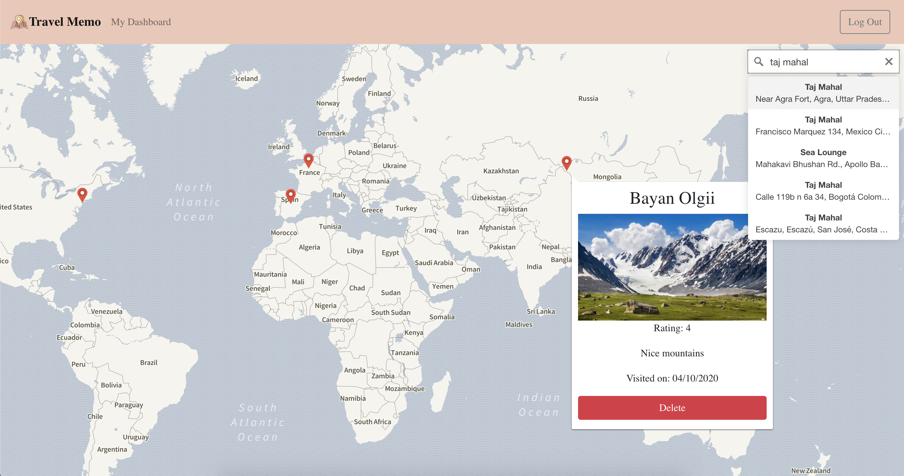
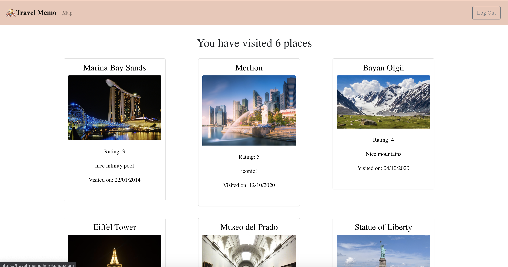

# Travel Memo - SEI-24 PROJECT 4

## About the app
A digital scrapbook to help you keep track of the beautiful places (and people) you have visited. Post a photo, write a note, and relive your adventures time and again!

Try it out [here](https://travel-memo.herokuapp.com/).

## User Story
"As someone who travels multiple times a year, I would like a simple and uncluttered platform to make a quick note of the places I have visited, be it uploading a simple photo, or jotting down my impressions at that time. This would make it easy for me to showcase my footprints and relive my adventures."

## Features
* Interactive world map built with Mapbox and react-map-gl
* Geocoder to help find locations (react-map-gl-geocoder)
* Double click on any point to add an entry
* Upload photos hosted on Cloudinary
* Map pins to mark entries
* Click pins to view more details
* Dashboard view for a quick summary of all the places logged
* Click on a place to be directed back to point on the map

## Screenshots

## Installation instructions
Fork this repo and run npm install in both the root and client directories. Create an account and/or login to access the map view

## Core Technologies
* MongoDB noSQL database with 2 models: users and logs
* Express for RESTful routing
* React UI
* Node environment

## Other tech
### UI
* Material UI
* Bootstrap

### Mapping
* Mapbox
* React-Map-GL
* React-Map-GL-Geocoder

### Authentication
* Bcrypt
* JsonWebToken
* Js-Cookie

### Media Management
* Cloudinary

### ORM
* Mongoose

## Learnings
* Using a NoSQL database
* Manipulating geolocation data and implementing an interactive map
* Working with file uploads
* Custom front-end form validation
* Exposure to more advanced React concepts (e.g. more complex state management,context API, useCallback hooks, etc.)
* JWT authentication

## Challenges
* Lack of free travel-related APIs leading to changing of project idea
* Passing of props between components without a common ancestor - learned to create a context provider.
* Git issues where changes were not being tracked, had to re-initialise git

